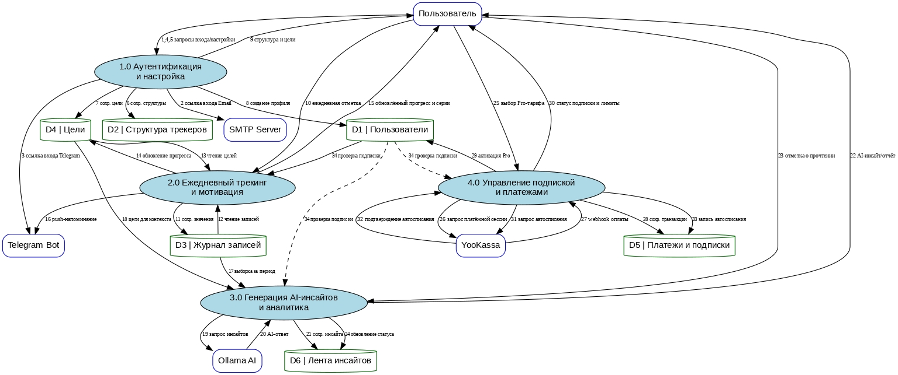
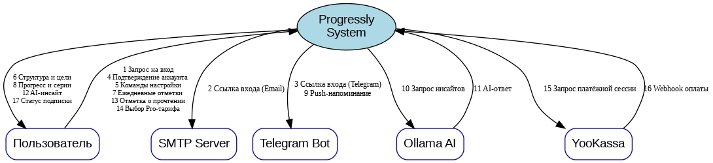

# Контекстная диаграмма DFD сущности
- _Пользователь_ – человек, взаимодействующий с системой через web или мобильный интерфейс.
- _SMTP Server_ – сервер электронной почты для отправки одноразовых ссылок аутентификации.
- _Telegram Bot_ – мессенджер-бот для отправки push-напоминаний и альтернативного канала входа.
- _Ollama AI_ – внешний ИИ-сервис, генерирующий аналитические сводки и инсайты на основе пользовательских данных.
- _YooKassa_ – платёжный шлюз, обрабатывающий подписки и регулярные списания.
##  Контектстная диаграмма DFD уровень 0

### Таблица описания DFD уровень 0.
| № | Наименование потока | Сигнал | Сущность | Описание |
|--|--|--|--|--|
| 1 | Запрос на вход | Входной | Пользователь | Пользователь передаёт системе идентификатор (email / Telegram ID) для получения ссылки входа. |
| 2 | Ссылка для входа (Email) | Выходной | SMTP Server | Система формирует и отправляет письмо с одноразовой ссылкой аутентификации. |
| 3 | Ссылка для входа (Telegram) | Выходной | Telegram Bot | Система отправляет через Telegram Bot сообщение с одноразовой ссылкой аутентификации. |
| 4 | Подтверждение аккаунта | Входной | Пользователь | Пользователь переходит по ссылке, система фиксирует успешное подтверждение учётной записи. |
| 5 | Команды настройки трекера | Входной | Пользователь | Пользователь добавляет, удаляет или редактирует поля трекера, создаёт цели. |
| 6 | Отображение структуры и целей | Выходной | Пользователь | Система возвращает пользователю актуальную конфигурацию его персональной таблицы и текущие цели. |
| 7 | Ежедневные отметки | Входной | Пользователь | Пользователь вносит значения (бинарные, числовые и др.) за конкретную дату. |
| 8 | Обновлённый прогресс и серии | Выходной | Пользователь | Система передаёт пользователю пересчитанные streak’и, процент выполнения целей и визуализацию прогресса. |
| 9 | Push-напоминание | Выходной | Telegram Bot | По расписанию система инициирует отправку напоминания через Telegram Bot о необходимости заполнить данные. |
| 10 | Запрос на генерацию инсайтов | Выходной | Ollama AI | Система подготавливает выборку данных за период и отправляет её в Ollama AI. |
| 11 | Сгенерированный AI-ответ | Входной | Ollama AI | Ollama AI возвращает текстовую сводку, интерпретацию трендов и рекомендации. |
| 12 | AI-инсайт / отчёт | Выходной | Пользователь | Система публикует полученный инсайт в ленте пользователя. |
| 13 | Отметка о прочтении инсайта | Входной | Пользователь | Пользователь отмечает инсайт как прочитанный (обратная связь). |
| 14 | Выбор Pro-тарифа | Входной | Пользователь | Пользователь инициирует переход на платный тарифный план. |
| 15 | Запрос платёжной сессии | Выходной | YooKassa | Система направляет в YooKassa данные для создания платёжной формы (сумма, описание, идентификатор пользователя). |
| 16 | Webhook подтверждения оплаты | Входной | YooKassa | YooKassa асинхронно уведомляет систему об успешном проведении платежа (включая данные для рекуррентных списаний). |
| 17 | Статус подписки и лимиты | Выходной | Пользователь | Система информирует пользователя об активации Pro-статуса и изменении доступных возможностей. |
## Контекстая диаграммв DFD уровень 1.
Декомопозиция Progressly на 4 подпроцесса:
- Аутентификация и настройка пользователя (регистрация, вход, конфигурирование трекера и целей)
- Ежедневный трекинг и мотивация (ввод значений, напоминания, пересчёт серий и прогресса)
- Генерация AI-инсайтов и аналитика (сбор данных, взаимодействие с Ollama, публикация отчётов)
- Управление подпиской и платежами (выбор тарифа, работа с YooKassa, активация Pro, рекуррентные списания)

### Таблица описания DFD уровень 1.
| № | Наименование потока | Сигнал | Сущность | Описание |
|--|--|--|--|--|
| 1 | Запрос на вход | Входной | Пользователь | Пользователь передаёт email / Telegram ID для получения ссылки аутентификации. |
| 2 | Отправка ссылки входа через Email | Выходной | SMTP Server | Система формирует и отправляет письмо с одноразовой ссылкой. |
| 3 | Отправка ссылки входа через Telegram | Выходной | Telegram Bot | Сообщение со ссылкой отправляется через Telegram Bot. |
| 4 | Подтверждение аккаунта | Входной | Пользователь | Факт успешного перехода по ссылке, верификация учётной записи. |
| 5 | Команды настройки трекера | Входной | Пользователь | Добавление, редактирование или удаление полей, установка целей. |
| 6 | Сохранение структуры полей | Внутренний | D2 \| Структура трекеров | Запись метаданных полей (название, тип, расписание). |
| 7 | Сохранение цели | Внутренний | D4 \| Цели | Создание или обновление цели с привязкой к полям. |
| 8 | Создание / обновление профиля | Внутренний | D1 \| Пользователи | Сохранение пользовательских настроек и статуса. |
| 9 | Отображение структуры и целей | Выходной | Пользователь | Возврат пользователю актуальной конфигурации трекера и списка целей. |
| 10 | Ежедневная отметка | Входной | Пользователь | Ввод значения (бинарное, числовое) за конкретную дату и поле. |
| 11 | Сохранение значения | Внутренний | D3 \| Журнал записей | Запись фактического значения в журнал. |
| 12 | Чтение записей для пересчёта | Внутренний | D3 \| Журнал записей | Извлечение данных, необходимых для расчёта серий и прогресса. |
| 13 | Чтение целей | Внутренний | D4 \| Цели | Получение текущих целевых показателей. |
| 14 | Обновление прогресса по целям | Внутренний | D4 \| Цели | Пересчёт и сохранение процента выполнения цели. |
| 15 | Обновлённый прогресс и серии | Выходной | Пользователь | Отображение актуальных streak, графиков и статуса целей. |
| 16 | Push-напоминание | Выходной | Telegram Bot | Отправка уведомления о необходимости внести данные. |
| 17 | Чтение данных за период | Внутренний | D3 \| Журнал записей | Выборка записей за неделю/месяц для подготовки отчёта. |
| 18 | Чтение целей для контекста | Внутренний | D4 \| Цели | Получение целей, необходимых для генерации инсайта. |
| 19 | Запрос к Ollama AI | Выходной | Ollama AI | Отправка выборки данных и инструкции внешнему ИИ‑сервису. |
| 20 | AI-ответ | Входной | Ollama AI | Получение текстовой сводки, интерпретации и рекомендаций. |
| 21 | Сохранение инсайта | Внутренний | D6 \| Лента инсайтов | Публикация сгенерированной сводки в ленту. |
| 22 | AI-инсайт для пользователя | Выходной | Пользователь | Доставка отчёта в интерфейс (лента или уведомление). |
| 23 | Отметка о прочтении | Входной | Пользователь | Пользователь фиксирует, что ознакомился с инсайтом. |
| 24 | Обновление статуса инсайта | Внутренний | D6 \| Лента инсайтов | Изменение флага прочтения. |
| 25 | Выбор Pro-тарифа | Входной | Пользователь | Пользователь инициирует переход на платный тариф. |
| 26 | Запрос платёжной сессии | Выходной | YooKassa | Передача данных для формирования платёжной формы. |
| 27 | Webhook подтверждения оплаты | Входной | YooKassa | Уведомление об успешном платеже и параметрах рекуррентного списания. |
| 28 | Сохранение транзакции | Внутренний | D5 \| Платежи и подписки | Запись информации о платеже и способе оплаты. |
| 29 | Активация Pro-статуса | Внутренний | D1 \| Пользователи | Обновление профиля: уровень подписки, расширенные лимиты. |
| 30 | Статус подписки и лимиты | Выходной | Пользователь | Информирование о текущем тарифе и доступных возможностях. |
| 31 | Запрос на рекуррентное списание | Выходной | YooKassa | Инициирование автоматического платежа. |
| 32 | Подтверждение рекуррентного платежа | Входной | YooKassa | Ответ платёжного шлюза о результате автосписания. |
| 33 | Сохранение записи об автосписании | Внутренний | D5 \| Платежи и подписки | Логирование результата очередного списания. |
| 34 | Проверка статуса подписки | Внутренний | D1 \| Пользователи | Чтение информации о подписке для определения доступных функций. |
