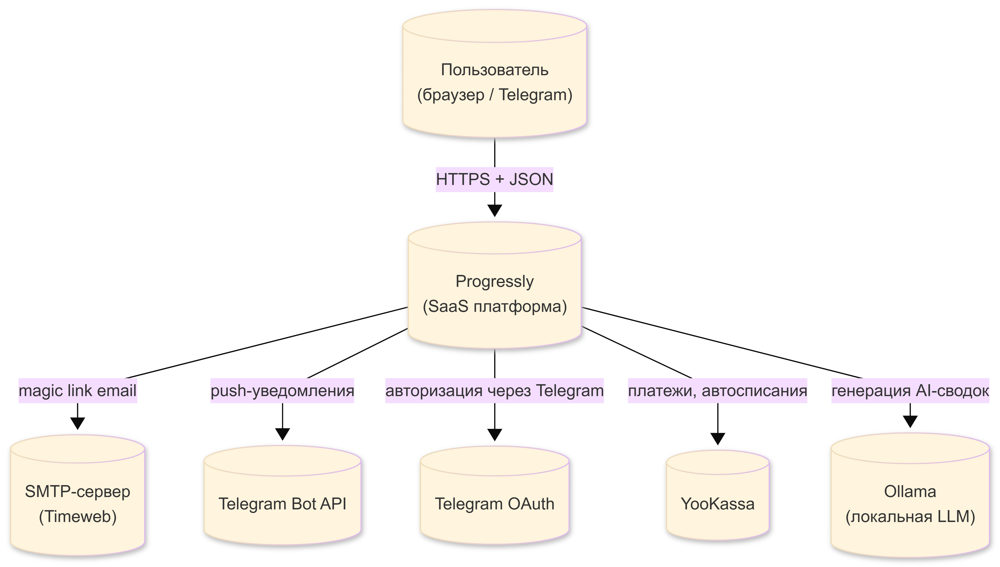
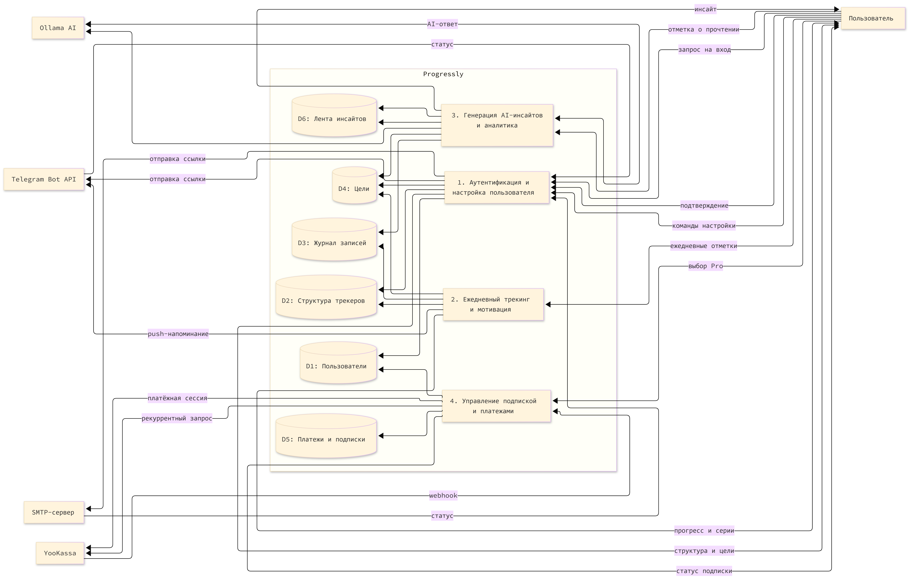
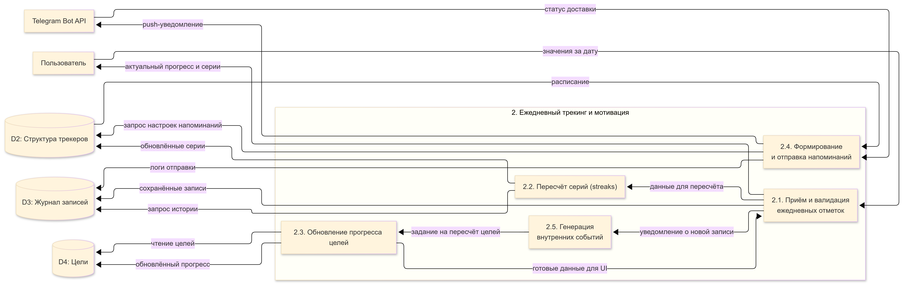

# Контекстная диаграмма DFD сущности (была уже представлена в SPRINT2, маленькие доработки и примечания)
- _Пользователь_ – человек, взаимодействующий с системой через web или мобильный интерфейс.
- _SMTP Server_ – сервер электронной почты для отправки одноразовых ссылок аутентификации.
- _Telegram Bot_ – мессенджер-бот для отправки push-напоминаний и альтернативного канала входа.
- _Ollama AI_ – внешний ИИ-сервис, генерирующий аналитические сводки и инсайты на основе пользовательских данных.
- _YooKassa_ – платёжный шлюз, обрабатывающий подписки и регулярные списания.
##  Контектстная диаграмма DFD уровень 0

*_Примечания:_  
_Пользователь не взаимодействует напрямую с Ollama – только через систему.  
Telegram используется дважды: как OIDC-провайдер для входа и как канал для push‑уведомлений (разные API)._  
| Элемент | Тип | Назначение | Исходящие вызовы (синхр/асинхр) |
|---------|------|-------------|----------------------------------|
| Пользователь | Актор | Человек, использующий Progressly через веб-браузер (mobile‑first) или Telegram (уведомления) | HTTPS‑запросы к Web API |
| Progressly | Система | Основная платформа (контейнеры: Web API, Worker, БД, Redis, Ollama) | – |
| SMTP (Timeweb) | Внешняя система | Отправка писем (magic link, уведомления) | Асинхронно через SMTP‑релей |
| Telegram OAuth | Внешняя система | Авторизация через Telegram (OIDC) | Синхронно (обмен кода на JWT) |
| Telegram Bot API | Внешняя система | Отправка push‑уведомлений | Асинхронно (очередь задач) |
| YooKassa | Внешняя система | Платежи, подписки, автосписания, webhook’и | Синхронно (создание платежа) Асинхронно (уведомления) |
| Ollama | Внешняя система | Локальная LLM для AI‑сводок | Асинхронно (воркер генерирует) |
##  Контектстная диаграмма DFD уровень 1

##  Контектстная диаграмма DFD уровень 2 Детализация процесса 1. Аутентификация и настройка пользователя

##  Контектстная диаграмма DFD уровень 2 Детализация процесса 2. Ежедневный трекинг и мотивация

##  Контектстная диаграмма DFD уровень 2 Детализация процесса 3. Генерация AI-инсайтов и аналитика
##  Контектстная диаграмма DFD уровень 2 Детализация процесса 4. Управление подпиской и платежами
