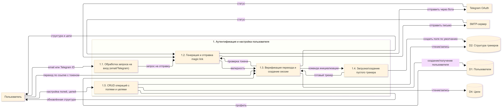
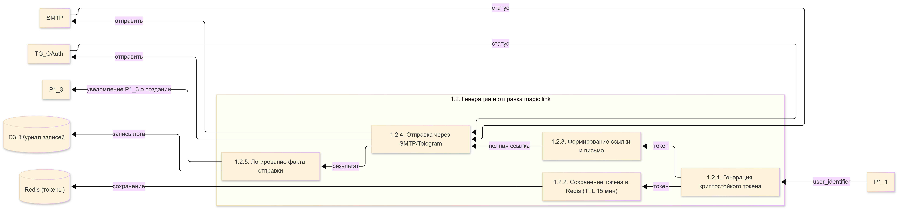
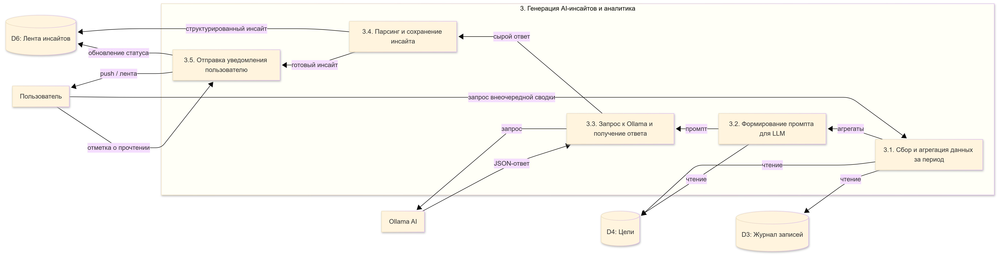
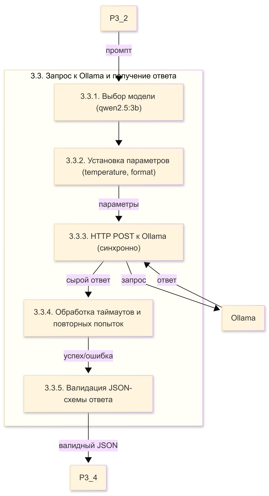
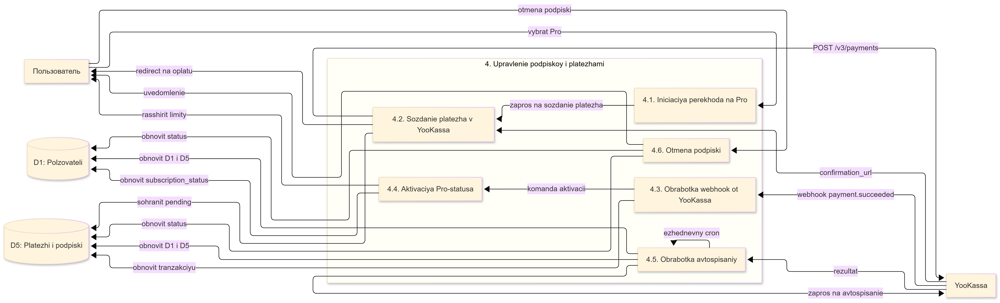
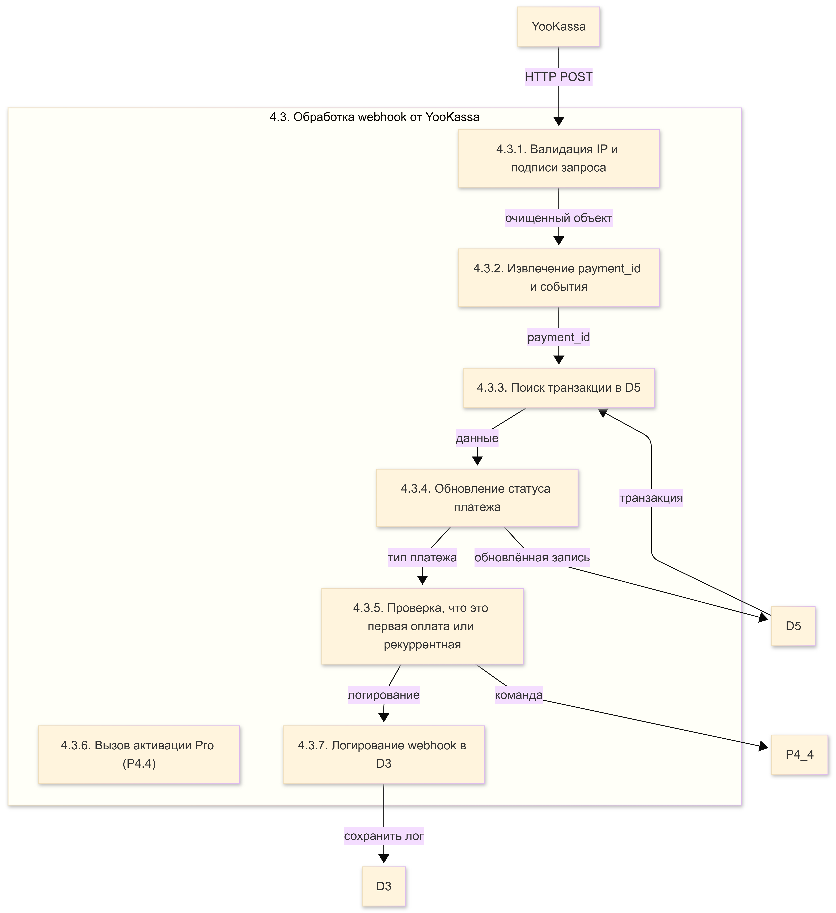

# Контекстная диаграмма DFD сущности (была уже представлена в SPRINT2, маленькие доработки и примечания)
- _Пользователь_ – человек, взаимодействующий с системой через web или мобильный интерфейс.
- _SMTP Server_ – сервер электронной почты для отправки одноразовых ссылок аутентификации.
- _Telegram Bot_ – мессенджер-бот для отправки push-напоминаний и альтернативного канала входа.
- _Ollama AI_ – внешний ИИ-сервис, генерирующий аналитические сводки и инсайты на основе пользовательских данных.
- _YooKassa_ – платёжный шлюз, обрабатывающий подписки и регулярные списания.
##  Контектстная диаграмма DFD уровень 0

*_Примечания:_  
_Пользователь не взаимодействует напрямую с Ollama – только через систему.  
Telegram используется дважды: как OIDC-провайдер для входа и как канал для push‑уведомлений (разные API)._  
| Элемент | Тип | Назначение | Исходящие вызовы (синхр/асинхр) |
|---------|------|-------------|----------------------------------|
| Пользователь | Актор | Человек, использующий Progressly через веб-браузер (mobile‑first) или Telegram (уведомления) | HTTPS‑запросы к Web API |
| Progressly | Система | Основная платформа (контейнеры: Web API, Worker, БД, Redis, Ollama) | – |
| SMTP (Timeweb) | Внешняя система | Отправка писем (magic link, уведомления) | Асинхронно через SMTP‑релей |
| Telegram OAuth | Внешняя система | Авторизация через Telegram (OIDC) | Синхронно (обмен кода на JWT) |
| Telegram Bot API | Внешняя система | Отправка push‑уведомлений | Асинхронно (очередь задач) |
| YooKassa | Внешняя система | Платежи, подписки, автосписания, webhook’и | Синхронно (создание платежа) Асинхронно (уведомления) |
| Ollama | Внешняя система | Локальная LLM для AI‑сводок | Асинхронно (воркер генерирует) |  

#### Процессы
P1 – Аутентификация и настройка пользователя – вход, создание профиля, настройка полей и целей.  
P2 – Ежедневный трекинг и мотивация – ввод данных, пересчёт серий, обновление прогресса целей, отправка напоминаний.  
P3 – Генерация AI-инсайтов и аналитика – сбор данных, взаимодействие с Ollama, сохранение и показ инсайтов.  
P4 – Управление подпиской и платежами – подписка на Pro, обработка платежей, автосписания, отмена.  
#### Хранилища
D1 – пользователи  
D2 – структура трекеров  
D3 – журнал записей  
D4 – цели  
D5 – платежи  
D6 – лента инсайтов  
##  Контектстная диаграмма DFD уровень 1

| ID | Откуда | Куда | Данные | Периодичность |
|----|--------|------|--------|----------------|
| 1 | P1 | D1 | Профиль пользователя | При регистрации/входе |
| 2 | P1 | D2 | Метаданные полей | При настройке трекера |
| 3 | P1 | D4 | Цели | При создании/изменении |
| 4 | P2 | D3 | Журнал записей | Каждая отметка |
| 5 | P2 | D4 | Прогресс целей | После каждой отметки |
| 6 | P2 | D2 | Настройки напоминаний | При формировании push |
| 7 | P3 | D3 | Выборка за период | Раз в неделю / по запросу |
| 8 | P3 | D4 | Контекст целей | Перед генерацией инсайта |
| 9 | P3 | D6 | Сгенерированные инсайты | После ответа Ollama |
| 10 | P4 | D1 | Pro-статус | После оплаты |
| 11 | P4 | D5 | Транзакции | При каждом платеже | 

##  Контектстная диаграмма DFD уровень 2 Детализация процесса 1. Аутентификация и настройка пользователя

**Таблица потоков для P1**
| № | Поток | Откуда | Куда | Описание | Тип данных |
|---|-------|--------|------|----------|-------------|
| 1 | email / Telegram ID | User | P1_1 | Идентификатор для входа | строка |
| 2 | запрос на отправку | P1_1 | P1_2 | user_identifier, метод (email/telegram) | команда |
| 3 | отправить письмо | P1_2 | SMTP | HTML с magic link | ~2 KB |
| 4 | статус отправки | SMTP | P1_2 | success/error | bool |
| 5 | переход по ссылке с токеном | User | P1_3 | одноразовый токен | ~200 B |
| 6 | проверка токена | P1_3 | P1_2 | token | запрос |
| 7 | валидность | P1_2 | P1_3 | user_id или null | число |
| 8 | создание/получение пользователя | P1_3 | D1 | INSERT или SELECT | SQL |
| 9 | профиль | D1 | P1_3 | id, tier, telegram_id | запись |
| 10 | команда инициализации | P1_3 | P1_4 | user_id, флаг new_user | событие |
| 11 | создать поля по умолчанию | P1_4 | D2 | шаблон "Спорт, Вода, Сон" | INSERT |
| 12 | готовый трекер | P1_4 | P1_3 | подтверждение | сигнал |
| 13 | структура и цели | P1_3 | User | JSON с полями и целями | до 50 KB |
| 14 | настройка полей, целей | User | P1_5 | CRUD операции | JSON |
| 15 | чтение/запись в D2/D4 | P1_5 | D2/D4 | SQL | синхронно |
| 16 | обновлённая структура | P1_5 | User | актуальные данные | JSON |

#### Назначение
Обеспечить вход пользователя (без пароля) через email или Telegram, создание профиля, инициализацию пустого трекера и CRUD операций с полями/целями.
#### Подпроцессы
P1.1 – обработка запроса на вход (email/Telegram ID)  
P1.2 – генерация и отправка magic link (через SMTP или Telegram)  
P1.3 – верификация перехода, создание сессии JWT  
P1.4 – загрузка/создание пустого трекера (шаблон полей)  
P1.5 – CRUD полей и целей (с проверкой лимитов Free/Pro)  
#### Ключевые связи
P1.2 сохраняет токен в Redis (TTL 15 мин).  
P1.3 проверяет токен, создаёт пользователя в D1, вызывает P1.4 для инициализации.  
P1.5 работает напрямую с D2 и D4.
###  Уровень dfd 3 Детализация подпроцесса P1.2 (Генерация и отправка magic link)

**Таблица потоков для P1.2**
| № | Поток | Откуда | Куда | Данные |
|---|-------|--------|------|--------|
| 1 | user_identifier | P1_1 | P1_2_1 | email или telegram_id |
| 2 | токен | P1_2_1 | P1_2_2 | случайная строка (32 байта) |
| 3 | сохранение | P1_2_2 | Redis | key=magic:{token}, value=user_id, TTL=900с |
| 4 | токен для ссылки | P1_2_1 | P1_2_3 | тот же токен |
| 5 | полная ссылка | P1_2_3 | P1_2_4 | — |
| 6 | отправить | P1_2_4 | SMTP | письмо с кнопкой |
| 7 | отправить (альт.) | P1_2_4 | TG_OAuth | сообщение через бота |
| 8 | статус | SMTP/TG | P1_2_4 | success или ошибка |
| 9 | результат | P1_2_4 | P1_2_5 | статус доставки |
| 10 | запись лога | P1_2_5 | D3 | user_id, timestamp, метод, статус |
| 11 | уведомление | P1_2_5 | P1_3 | событие "MagicLinkSent" |
##  Контектстная диаграмма DFD уровень 2 Детализация процесса 2. Ежедневный трекинг и мотивация

**Таблица потоков**
| № | Поток | Откуда | Куда | Описание | Тип |
|---|-------|--------|------|----------|-----|
| 1 | значения за дату | User | P2_1 | {field_id, date, value} | Вход |
| 2 | сохранение записей | P2_1 | D3 | INSERT INTO entries | Синхр. |
| 3 | данные для пересчёта | P2_1 | P2_2 | field_id, current_date | Событие |
| 4 | запрос истории | P2_2 | D3 | SELECT entries WHERE ... | SQL |
| 5 | массив значений | D3 | P2_2 | список (date, value) | Ответ |
| 6 | обновление серий | P2_2 | D2 | UPDATE tracker_fields SET streak | SQL |
| 7 | уведомление о новой записи | P2_1 | P2_5 | событие EntryCreated | Асинхр. |
| 8 | задание на пересчёт целей | P2_5 | P2_3 | user_id, field_id | Команда |
| 9 | чтение целей | P2_3 | D4 | SELECT goals WHERE field_id = ? | SQL |
| 10 | цели | D4 | P2_3 | список целей | Ответ |
| 11 | обновление прогресса | P2_3 | D4 | UPDATE goals SET progress | SQL |
| 12 | готовые данные для UI | P2_3 | P2_1 | агрегированный прогресс | Возврат |
| 13 | актуальный прогресс | P2_1 | User | UI‑обновление | Выход |
| 14 | запрос расписаний | P2_4 | D2 | SELECT reminders | Cron |
| 15 | расписание | D2 | P2_4 | {user_id, tg_id, time} | Ответ |
| 16 | push-уведомление | P2_4 | TG_Bot | POST /sendMessage | Асинхр. |
| 17 | статус доставки | TG_Bot | P2_4 | {ok, message_id} | Асинхр. |
| 18 | логи отправки | P2_4 | D3 | INSERT INTO notification_logs | SQL |
#### Подпроцессы
P2.1 – приём и валидация отметок  
P2.2 – пересчёт серий (streaks)  
P2.3 – обновление прогресса целей  
P2.4 – формирование и отправка напоминаний  
P2.5 – генерация внутренних событий
#### Ключевые связи
P2.1 сохраняет записи в D3 и инициирует P2.2/P2.5.   
P2.2 читает историю из D3 и обновляет D2.  
P2.3 обновляет D4. P2.4 читает D2 и отправляет push через Telegram.  

##  Контектстная диаграмма DFD уровень 2 Детализация процесса 3. Генерация AI-инсайтов и аналитика

**Таблица потоков для P3**
| № | Поток | Откуда | Куда | Описание | Периодичность |
|---|-------|--------|------|----------|----------------|
| 1 | запрос внеочередной сводки | User | P3_1 | HTTP-запрос от Pro-пользователя | по требованию |
| 2 | чтение журнала записей | P3_1 | D3 | SELECT за неделю/месяц | раз в неделю (cron) |
| 3 | чтение целей | P3_1 | D4 | цели, связанные с полями | там же |
| 4 | агрегаты | P3_1 | P3_2 | completion_rate, streaks, топ привычек | JSON |
| 5 | промпт | P3_2 | P3_3 | текст + агрегаты | ~10 KB |
| 6 | запрос к LLM | P3_3 | Ollama | POST /api/generate | синхронный |
| 7 | JSON-ответ | Ollama | P3_3 | {summary, insights, advice} | ~3 KB |
| 8 | сырой ответ | P3_3 | P3_4 | строка JSON | ~3 KB |
| 9 | структурированный инсайт | P3_4 | D6 | INSERT INTO insights | синхронно |
| 10 | готовый инсайт | P3_4 | P3_5 | объект инсайта | событие |
| 11 | push / лента | P3_5 | User | уведомление и отображение | асинхронно |
| 12 | отметка о прочтении | User | P3_5 | флаг | HTTP |
| 13 | обновление статуса | P3_5 | D6 | UPDATE insights SET read=true | SQL |
#### Назначение
Превращать накопленные данные пользователя в полезные сводки, инсайты и советы с помощью локальной LLM (Ollama), а также предоставлять аналитические дашборды продукт-овнеру.
#### Подпроцессы
P3.1 – сбор и агрегация данных за период (неделя/месяц)  
P3.2 – формирование промпта для LLM (включая метрики и цели)  
P3.3 – запрос к Ollama и получение JSON-ответа  
P3.4 – парсинг ответа и сохранение структурированного инсайта в D6  
P3.5 – отправка уведомления пользователю (push/лента) и обработка отметки о прочтении
#### Ключевые связи
P3.1 читает D3 и D4. P3.2 генерирует промпт. P3.3 вызывает Ollama (синхронно, но через воркер). P3.4 сохраняет результат в D6. P3.5 читает D6 и показывает пользователю.
### Уровень dfd 3 Детализация подпроцесса P3.3 (Запрос к Ollama и получение ответа)

**Таблица потоков**
| № | Поток | Откуда | Куда | Значение |
|---|-------|--------|------|----------|
| 1 | промпт | P3_2 | P3_3_1 | текст с данными пользователя |
| 2 | выбор модели | P3_3_1 | P3_3_2 | qwen2.5:3b |
| 3 | параметры | P3_3_2 | P3_3_3 | {temperature:0.7, format:"json", stream:false} |
| 4 | HTTP-запрос | P3_3_3 | Ollama | POST |
| 5 | ответ | Ollama | P3_3_3 | JSON (поле response) |
| 6 | сырой ответ | P3_3_3 | P3_3_4 | текст из response |
| 7 | повторные попытки | P3_3_4 | P3_3_3 | при таймауте – до 3 раз с экспоненциальной задержкой |
| 8 | валидный JSON | P3_3_5 | P3_4 | распарсенный dict |
##  Контектстная диаграмма DFD уровень 2 Детализация процесса 4. Управление подпиской и платежами

**Таблица потоков для P4**
| № | Поток | Откуда | Куда | Описание | Примечание |
|---|-------|--------|------|----------|-------------|
| 1 | выбрать Pro | User | P4_1 | user_id, тариф (месяц/год) | синхронно |
| 2 | запрос на создание платежа | P4_1 | P4_2 | сумма, описание, return_url | |
| 3 | POST /v3/payments | P4_2 | YooKassa | idempotence_key, metadata | |
| 4 | confirmation_url | YooKassa | P4_2 | ссылка на оплату | |
| 5 | сохранить транзакцию pending | P4_2 | D5 | INSERT со статусом pending | |
| 6 | redirect на оплату | P4_2 | User | HTTP 302 | |
| 7 | webhook (payment.succeeded) | YooKassa | P4_3 | объект платежа | асинхронно |
| 8 | обновить транзакцию | P4_3 | D5 | UPDATE статус → succeeded | |
| 9 | команда активации | P4_3 | P4_4 | user_id, дата окончания | |
| 10 | обновить subscription_status | P4_4 | D1 | SET pro_until = NOW()+30d | |
| 11 | расширить лимиты | P4_4 | User | кэш на клиенте | |
| 12 | отмена подписки | User | P4_6 | user_id | |
| 13 | обновить статус | P4_6 | D1/D5 | cancelled | |
| 14 | ежедневный cron | P4_5 | P4_5 | поиск подписок с pro_until < NOW() | каждый час |
| 15 | запрос на автосписание | P4_5 | YooKassa | payment_method_id | |
| 16 | результат автосписания | YooKassa | P4_5 | success/fail | |
| 17 | обновить D5 и D1 | P4_5 | D5/D1 | новая дата окончания или блокировка | |
#### Назначение:
Обеспечить полный жизненный цикл Pro-подписки: инициацию, оплату через YooKassa, активацию, рекуррентные списания, отмену и downgrade.
#### Подпроцесс
P4.1 – инициация перехода на Pro (выбор тарифа)  
P4.2 – создание платежа в YooKassa (с idempotency key)  
P4.3 – обработка webhook от YooKassa (валидация, обновление статуса)  
P4.4 – активация Pro-статуса и расширение лимитов в D1  
P4.5 – обработка автосписаний (cron-задача, запрос к YooKassa)  
P4.6 – отмена подписки пользователем (обновление статуса в D1/D5)  
#### Ключевые связи
P4.2 сохраняет транзакцию со статусом pending в D5.  
P4.3 по webhook'у обновляет статус и вызывает P4.4.  
P4.5 ежедневно проверяет истекающие подписки и инициирует автосписания.  
P4.6 переводит пользователя в Free-статус.
### Уровень dfd 3 Детализация подпроцесса P4.3 (Обработка webhook от YooKassa)

**Таблица потоков для P4.3**
| № | Поток | Откуда | Куда | Значение |
|---|-------|--------|------|----------|
| 1 | HTTP POST | YooKassa | P4_3_1 | тело webhook + заголовки |
| 2 | валидация IP | P4_3_1 | – | проверка по белому списку (185.71.76.0/24) |
| 3 | проверка подписи | P4_3_1 | – | сравнение SHA-256 хеша |
| 4 | очищенный объект | P4_3_1 | P4_3_2 | JSON-объект без проверки |
| 5 | payment_id | P4_3_2 | P4_3_3 | UUID из YooKassa |
| 6 | транзакция | D5 | P4_3_3 | запись по payment_id |
| 7 | данные | P4_3_3 | P4_3_4 | статус, метаданные, user_id |
| 8 | обновление статуса | P4_3_4 | D5 | UPDATE SET status = 'succeeded' |
| 9 | тип платежа | P4_3_5 | P4_3_5 | initial или renewal |
| 10 | команда активации | P4_3_5 | P4_4 | вызов P4_4.activate(user_id, days) |
| 11 | логирование webhook | P4_3_5 | P4_3_7 | запись факта обработки |
| 12 | сохранить лог | P4_3_7 | D3 | INSERT INTO webhook_logs |
