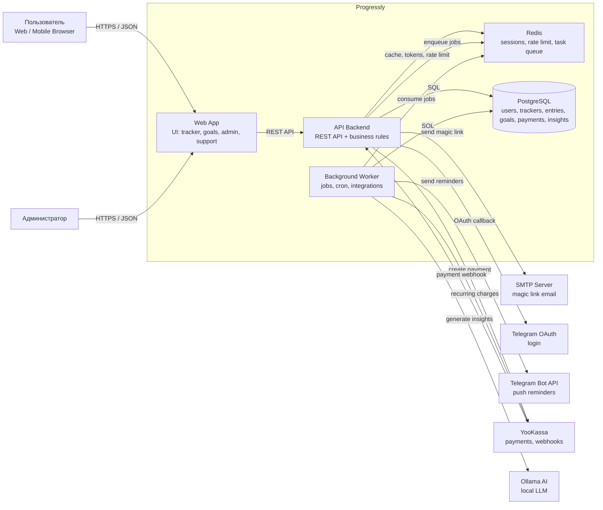
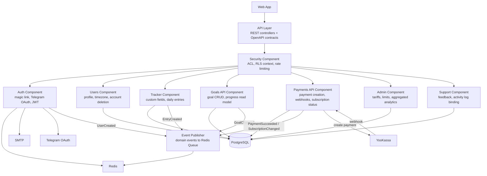
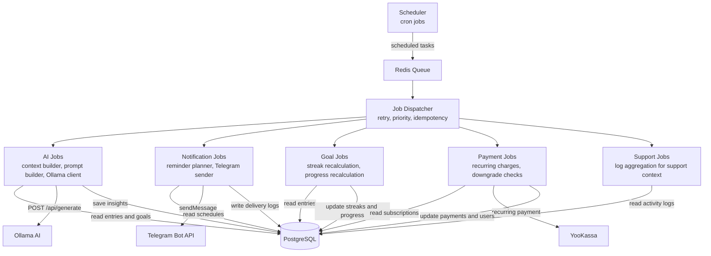
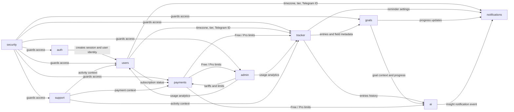
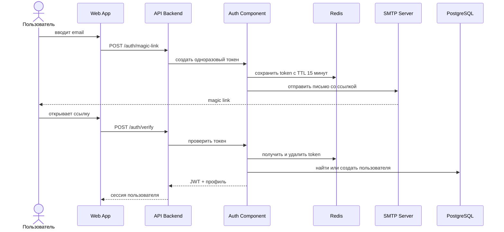
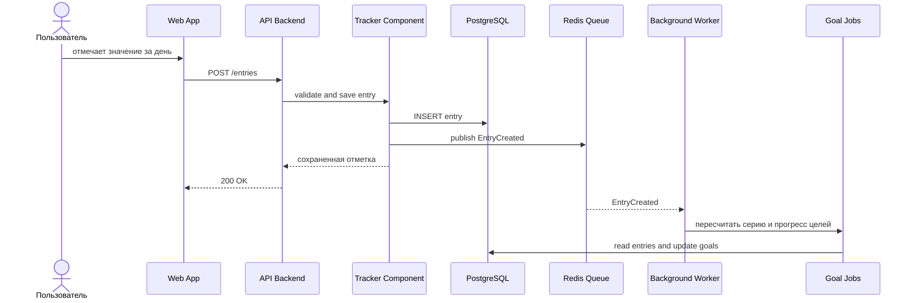
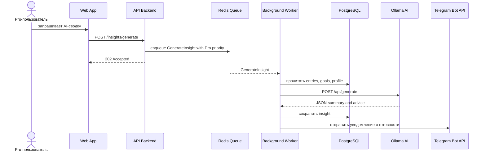
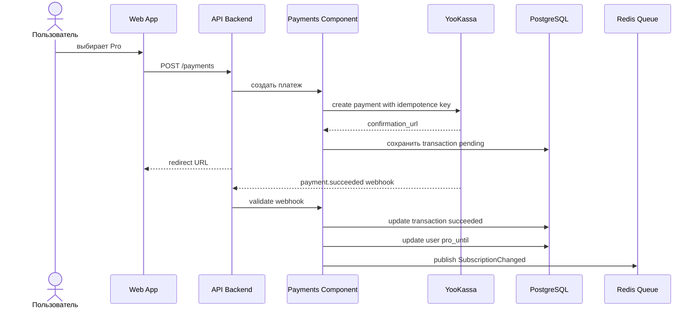

# 3. Внутренняя структура системы

Внутренняя структура Progressly строится вокруг разделения быстрых пользовательских операций и фоновой обработки. Пользовательские сценарии, где важен отклик интерфейса, проходят через Web App и API Backend. Долгие операции, внешние интеграции и периодические задачи выполняются через Redis Queue и Background Worker.

## 3.1 Контейнерная структура

### Назначение контейнеров

| Контейнер | Ответственность | Основные модули |
| :--- | :--- | :--- |
| **Web App** | Интерфейс пользователя и администратора: ежедневный календарь, цели, лента инсайтов, настройки, обратная связь, админ-панель. | tracker, goals, admin, support |
| **API Backend** | REST API, валидация команд, авторизация, лимиты, синхронная бизнес-логика, прием webhook'ов. | auth, users, tracker, security, payments, goals, admin, support |
| **Background Worker** | Асинхронные задачи, cron-процессы, тяжелые пересчеты, интеграции с Telegram, Ollama и YooKassa. | ai, notifications, goals, payments |
| **Redis** | Очередь задач, временные magic link токены, rate limiting, краткоживущий кэш. | auth, security, ai, notifications, goals |
| **PostgreSQL** | Постоянное хранение доменных данных и журналов. | все модули |
| **Ollama AI** | Локальная LLM для генерации инсайтов на основании агрегированного контекста. | ai |

## 3.2 Компоненты API Backend

API Backend разделен на компоненты по доменным границам. **API Layer** не содержит бизнес-логики: он принимает HTTP-запросы, проверяет формат данных по OpenAPI-контрактам и передает команды в нужный компонент. **Security Component** стоит перед доменными компонентами, потому что контроль доступа, лимиты Free/Pro и защита от частых запросов должны применяться одинаково ко всем пользовательским операциям.

События публикуются после успешной записи в PostgreSQL. Например, после сохранения ежедневной отметки компонент **tracker** создает событие `EntryCreated`, а worker уже пересчитывает цели, серии и задачи уведомлений. Это позволяет вернуть ответ пользователю быстро и не держать HTTP-запрос открытым из-за фоновой логики.

## 3.3 Компоненты Background Worker

Worker содержит компоненты, которые могут выполняться дольше 300 мс или зависят от внешних сервисов. **Job Dispatcher** отвечает за повторные попытки, приоритеты и идемпотентность задач. Это особенно важно для платежей и уведомлений: повтор задачи не должен создавать дубликаты списаний или отправлять одно и то же напоминание несколько раз.

Для **ai** используется отдельная очередь с приоритетом Pro-пользователей, потому что Ollama ограничена вычислительной мощностью локального сервера. Для **notifications** и **payments** применяются cron-задачи: напоминания зависят от часового пояса пользователя, а автосписания требуют регулярной проверки истекающих подписок.

## 3.4 Связи модулей между собой

### Ключевые зависимости

| Связь | Зачем нужна |
| :--- | :--- |
| **auth -> users** | После успешного magic link или Telegram OAuth система должна создать или найти профиль пользователя и выдать сессию. |
| **security -> все пользовательские модули** | Единая точка проверки ACL, тарифных лимитов и rate limiting снижает риск расхождения правил доступа между модулями. |
| **tracker -> goals** | Цели рассчитываются на основании ежедневных записей и настроек полей, поэтому tracker является источником событий для goals. |
| **tracker + goals -> ai** | AI-инсайты требуют истории отметок, текущих серий и целей пользователя, иначе рекомендации будут оторваны от контекста. |
| **users -> notifications** | Для корректной отправки напоминаний нужны часовой пояс, Telegram ID и пользовательские настройки. |
| **payments -> tracker / ai** | Тариф определяет лимиты Free/Pro: количество полей, доступность AI-сводок и приоритет задач. |
| **admin -> payments** | Админский модуль управляет тарифами и лимитами, которые затем применяются при оплате и проверке подписки. |
| **support -> users / tracker / payments** | Обращение в поддержку должно быть связано с профилем, активностью и платежным статусом пользователя. |

## 3.5 Основные сценарии взаимодействия

### Вход по magic link

### Ежедневная отметка и фоновые пересчеты

### Генерация AI-инсайта

### Оплата и активация Pro

## 3.6 Почему структура выбрана именно так

1. **Быстрые операции не зависят от тяжелых задач.** Ежедневная отметка, вход, чтение календаря и редактирование полей должны укладываться в целевой p95 < 300 мс. Поэтому API сохраняет минимально необходимое состояние и передает пересчеты, уведомления и AI в очередь.

2. **Внешние сервисы изолированы от пользовательского запроса.** Telegram Bot API, YooKassa и Ollama могут отвечать медленно или временно быть недоступны. Worker позволяет повторять задачи и деградировать отдельные функции без остановки tracker и auth.

3. **PostgreSQL остается единым источником истины.** Все долговременные данные хранятся в одной базе: профиль, поля, записи, цели, платежи и инсайты. Это упрощает поддержку связей между модулями и позволяет применять row-level security для защиты пользовательских данных.

4. **Redis используется только для краткоживущего состояния и очередей.** Magic link токены, rate limiting и задачи имеют естественный TTL или временный характер. Их хранение в Redis снижает нагрузку на PostgreSQL и ускоряет частые технические операции.

5. **Модули можно масштабировать независимо.** При росте нагрузки можно увеличить количество экземпляров Web App/API для HTTP-запросов и отдельно добавить worker-процессы для AI, уведомлений или платежных задач. Это соответствует требованию поддержки до 10 000 активных пользователей.

6. **Отказ отдельных модулей не ломает базовые сценарии.** Если Ollama недоступна, пользователь продолжает вести трекер и цели. Если Telegram Bot API временно не принимает сообщения, записи и прогресс сохраняются. Если YooKassa недоступна, новые Pro-активации задерживаются, но Free-функции продолжают работать.

## 3.7 Соответствие модулей внутренним компонентам

| Модуль | Web App | API Backend | Background Worker | PostgreSQL | Redis |
| :--- | :---: | :---: | :---: | :---: | :---: |
| **admin** | + | + |  | + |  |
| **auth** | + | + |  | + | + |
| **ai** | + | + | + | + | + |
| **goals** | + | + | + | + | + |
| **notifications** | + | + | + | + | + |
| **payments** | + | + | + | + | + |
| **security** |  | + |  | + | + |
| **support** | + | + | + | + |  |
| **tracker** | + | + | + | + | + |
| **users** | + | + |  | + |  |

Знак `+` означает, что модуль имеет ответственность или данные внутри соответствующего контейнера. Например, **ai** отображается в Web App как лента инсайтов, принимает команду генерации через API, выполняется в Worker, хранит результат в PostgreSQL и использует Redis для очереди задач.
